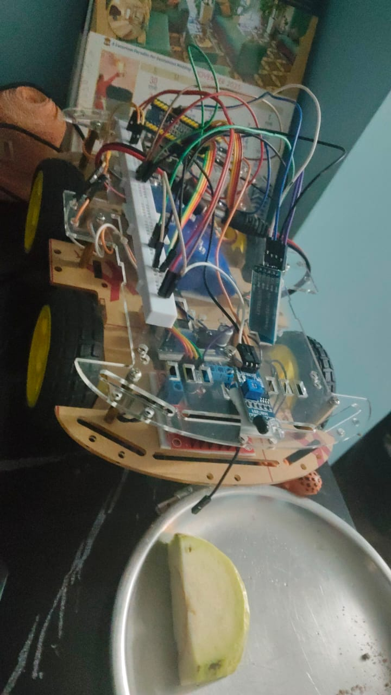

# STM32 Ackermann Car

Bare-metal STM32-based Ackermann steering robot with BLE control and collision avoidance

## Hardware
- STM32F103C8T6
- DC motors
- L298N motor driver
- 12v Batter pack
- Buck converter
- IR sensor (HW201)
- HC05

## Features
- No HAL used
- Register-level control
- Timer/PWM usage
- UART command control
- Garbage Data Safety Protocol
- Differential steering logic

## Image

## License
MIT License
